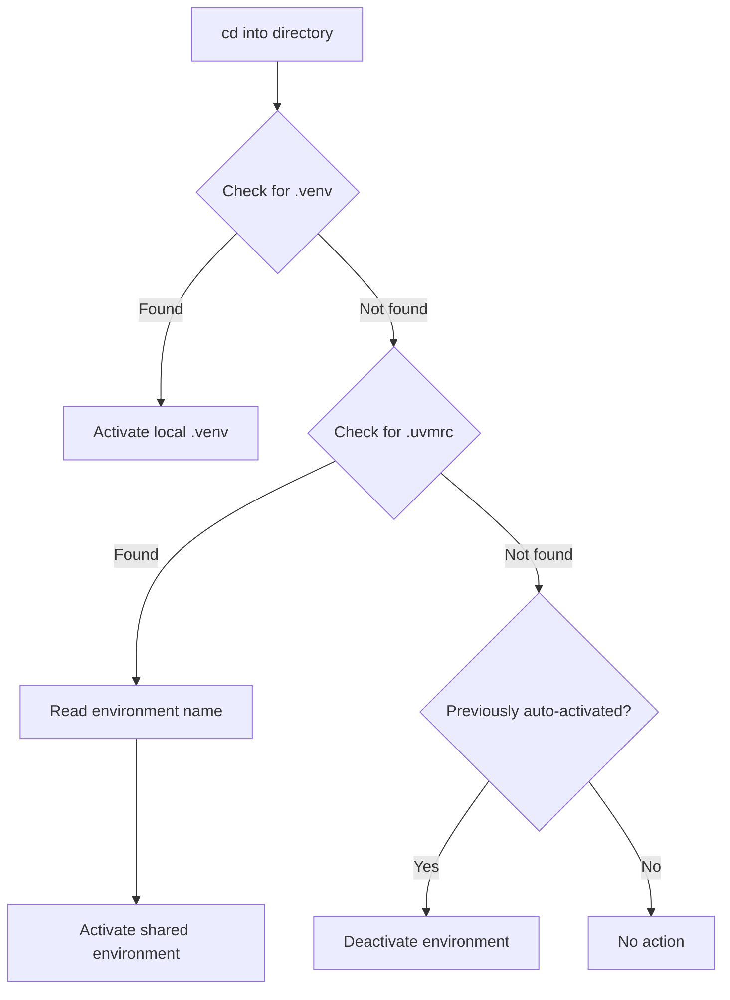

# uvm - UV Manager

<div align="center">

**A Conda-like Environment Manager for UV**

[](https://opensource.org/licenses/MIT)
[](https://www.gnu.org/software/bash/)
[](https://github.com/yourusername/uvm)

Simplify Python virtual environment management with UV's blazing-fast performance and Conda's intuitive commands.

[Features](#-features) • [Installation](#-installation) • [Quick Start](#-quick-start) • [Usage](#-usage) • [Auto-Activation](#-auto-activation) • [Uninstall](#-uninstall)

</div>

---

## 🌟 Features

- **🚀 Conda-like Commands**: Familiar `create`, `activate`, `deactivate`, `delete`, `list` commands
- **⚡ UV-Powered**: Leverages UV's 10-100x faster package installation
- **🔄 Smart Auto-Activation**: Automatically activates environments when entering project directories
- **🌏 China Mirrors**: Pre-configured with Tsinghua University mirrors for faster downloads
- **🎯 Dual Mode Support**:
  - **Local `.venv`**: Auto-detects project-local environments
  - **Shared Environments**: Centralized environment management in `~/uv_envs/`
- **🖥️ Cross-Platform**: Works on Linux, macOS, and Windows (Git Bash)

---

## 📋 Prerequisites

- **Bash** (or Zsh)
- **UV** (will be prompted to install if missing)

---

## 🚀 Installation

### Interactive Installation (Recommended for First-Time Users)

The installer features a **step-by-step wizard** that guides you through configuration:

#### Linux / macOS

```bash
# Clone the repository
git clone https://github.com/yourusername/uvm.git
cd uvm

# Run the interactive installer
./install.sh
```

**The wizard will ask you:**
1. **📁 Environment Directory** (default: `~/uv_envs`)
   - Press Enter to use default
   - Type `n` to enter custom path
   - Or directly type your custom path

2. **🔧 Install UV?** (if not already installed)
   - Automatically installs UV on Linux/macOS

3. **🐚 Enable auto-activation?** (default: Yes)
   - Auto-activate when entering directories with `.venv` or `.uvmrc`

#### Windows (Git Bash)

```bash
# 1. First, install UV in PowerShell (one-time setup)
powershell -ExecutionPolicy ByPass -c "irm https://astral.sh/uv/install.ps1 | iex"

# 2. Then, run the interactive installer in Git Bash
git clone https://github.com/yourusername/uvm.git
cd uvm
./install.sh
```

### Non-Interactive Installation

For automated setups or if you prefer defaults:

```bash
# Quick install with all defaults
./install.sh -y

# Install with custom environment directory
./install.sh --envs-dir /mnt/data/python-envs

# See all options
./install.sh --help
```

### Post-Installation

Reload your shell configuration:

```bash
source ~/.bashrc  # or ~/.zshrc for Zsh users
```

**Enable auto-activation** (optional but recommended):

```bash
echo 'eval "$(uvm shell-hook)"' >> ~/.bashrc
source ~/.bashrc
```

---

## 🎯 Quick Start

```bash
# Create a new environment with Python 3.11
uvm create myenv --python 3.11

# Activate the environment
uvm activate myenv

# Install packages (using UV's speed)
pip install requests numpy pandas

# List all environments
uvm list

# Deactivate
uvm deactivate

# Delete an environment
uvm delete myenv
```

---

## 📖 Usage

### Basic Commands

#### Create Environment

```bash
# Create with default Python
uvm create myenv

# Create with specific Python version
uvm create myenv --python 3.11

# Create at custom location
uvm create myenv --path /custom/path
```

#### Activate Environment

```bash
uvm activate myenv
```

> **Note**: Requires shell integration. Run `eval "$(uvm shell-hook)"` first.

#### Deactivate Environment

```bash
uvm deactivate
```

#### List Environments

```bash
# List all environments
uvm list

# Example output:
#   myenv                     Python 3.11.5      /home/user/uv_envs/myenv
# * active-env                Python 3.12.0      /home/user/uv_envs/active-env
```

The `*` indicates the currently active environment.

#### Delete Environment

```bash
# Delete with confirmation
uvm delete myenv

# Force delete (skip confirmation)
uvm delete myenv --force
```

---

## 🔄 Auto-Activation

uvm supports **intelligent auto-activation** with two priority levels:

### Priority 1: Local `.venv` (Highest)

Automatically detects and activates project-local `.venv` directories:

```bash
# In your project
cd ~/my-project
uv venv  # or uv sync

# Enter directory → auto-activates
cd ~/my-project
# 🔄 Auto-activating local .venv

# Leave directory → auto-deactivates
cd ~
# 🔻 Deactivating environment (left project directory)
```

**Use Case**: Modern projects with `pyproject.toml`, independent project environments.

### Priority 2: Shared Environment via `.uvmrc`

Specify a shared environment for projects using `requirements.txt`:

```bash
# Create a shared test environment
uvm create test-env --python 3.11

# In your legacy project
cd ~/legacy-project
echo "test-env" > .uvmrc

# Enter directory → auto-activates
cd ~/legacy-project
# 🔄 Auto-activating uvm environment: test-env
```

**Use Case**: Multiple projects sharing the same environment, test environments, learning environments.

### Comparison Table

| Scenario | Environment Location | Activation Method | Use Case |
|----------|---------------------|-------------------|----------|
| Local Environment | `./venv` | Auto-detect | Independent projects, `pyproject.toml` projects |
| Shared Environment | `~/uv_envs/myenv` | `.uvmrc` file | Multi-project sharing, test environments |
| Manual Activation | `~/uv_envs/myenv` | `uvm activate myenv` | Temporary use, quick testing |

---

## ⚙️ Configuration

### Configuration Files

- **uvm config**: `~/.config/uvm/`
  - `envs.json`: Environment metadata
- **UV config**: `~/.config/uv/uv.toml`
  - PyPI mirror: `https://pypi.tuna.tsinghua.edu.cn/simple`
  - Python downloads: `https://mirrors.tuna.tsinghua.edu.cn/python-releases/`

### Environment Variables

```bash
# Custom environment directory (default: ~/uv_envs)
export UVM_ENVS_DIR="${HOME}/my-custom-envs"

# Custom config directory (default: ~/.config/uvm)
export UVM_HOME="${HOME}/.uvm"
```

### Reconfigure Mirrors

```bash
uvm config mirror
```

### Show Current Configuration

```bash
uvm config show
```

---

## 🛠️ Troubleshooting

### `uvm: command not found`

**Solution**: Ensure `~/.local/bin` is in your PATH:

```bash
echo 'export PATH="${HOME}/.local/bin:$PATH"' >> ~/.bashrc
source ~/.bashrc
```

### `uvm activate` doesn't work

**Solution**: Enable shell integration:

```bash
echo 'eval "$(uvm shell-hook)"' >> ~/.bashrc
source ~/.bashrc
```

### Auto-activation not working

**Checklist**:
1. ✅ Shell hook enabled: `eval "$(uvm shell-hook)"` in `~/.bashrc`
2. ✅ Shell reloaded: `source ~/.bashrc`
3. ✅ For `.uvmrc`: File contains valid environment name
4. ✅ For `.venv`: Directory exists with `bin/activate` script

### Slow package downloads

**Solution**: Verify mirrors are configured:

```bash
cat ~/.config/uv/uv.toml

# Should contain:
# [[index]]
# url = "https://pypi.tuna.tsinghua.edu.cn/simple"
# default = true
```

If not, run:

```bash
uvm config mirror
```

---

## 🤝 Comparison with Other Tools

| Feature | uvm | Conda | venv + pip |
|---------|-----|-------|------------|
| Speed | ⚡⚡⚡ (UV) | 🐌 | 🐌🐌 |
| Auto-activation | ✅ | ❌ | ❌ |
| China Mirrors | ✅ (Built-in) | ⚙️ (Manual) | ⚙️ (Manual) |
| Python Version Management | ✅ | ✅ | ❌ |
| Disk Space | 💾 (Small) | 💾💾💾 (Large) | 💾 (Small) |
| Learning Curve | 📚 (Easy) | 📚📚 (Moderate) | 📚 (Easy) |

---

## 📚 Advanced Usage

### Custom Environment Location

```bash
# Create environment at specific path
uvm create myenv --path /mnt/data/envs/myenv

# The environment will still be tracked by uvm
uvm list  # Shows custom path
```

### Multiple Python Versions

```bash
# Create environments with different Python versions
uvm create py38 --python 3.8
uvm create py311 --python 3.11
uvm create py312 --python 3.12

# Switch between them easily
uvm activate py311
```

### Project-Specific Environments

**Option 1: Local `.venv` (Recommended for modern projects)**

```bash
cd ~/my-project
uv venv
uv pip install -r requirements.txt
# Auto-activates when you cd into the directory
```

**Option 2: Shared environment with `.uvmrc`**

```bash
cd ~/my-project
uvm create my-project-env --python 3.11
echo "my-project-env" > .uvmrc
# Auto-activates when you cd into the directory
```

---

## 🔍 How It Works



---

## 🐛 Known Issues

- **Windows**: 
  - ✅ **uvm fully works in Git Bash**
  - ❌ PowerShell/CMD not supported (use Git Bash instead)
  - ℹ️ UV must be installed manually first (see installation instructions)
- **Shell Integration**: Must run `eval "$(uvm shell-hook)"` for `activate`/`deactivate` to work.

---

## 🗺️ Roadmap

- [ ] Support for `pyenv` integration
- [ ] Environment export/import (`uvm export`, `uvm import`)
- [ ] Environment cloning (`uvm clone`)
- [ ] Shell completion (Bash/Zsh)
- [ ] Fish shell support

---

## 📄 License

This project is licensed under the MIT License - see the [LICENSE](LICENSE) file for details.

---

## 🙏 Acknowledgments

- [astral-sh/uv](https://github.com/astral-sh/uv) - The blazing-fast Python package installer
- [uv-custom](https://github.com/Wangnov/uv-custom) - Inspiration for China mirror configuration
- [Conda](https://docs.conda.io/) - Command design inspiration

---

## 🗑️ Uninstall

To remove UVM from your system:

```bash
cd /path/to/uvm
./uninstall.sh
```

**What gets removed:**
- UVM binary and library files
- Configuration files
- Shell integration

**What stays:**
- Your virtual environments (`~/uv_envs`)
- UV itself
- UV configuration (`~/.config/uv/uv.toml`)

📖 **Detailed guide:** [UNINSTALL.md](UNINSTALL.md)

---

## 📞 Support

- **Issues**: [GitHub Issues](https://github.com/yourusername/uvm/issues)
- **Discussions**: [GitHub Discussions](https://github.com/yourusername/uvm/discussions)

---

<div align="center">

**Made with ❤️ for Python developers who value speed and simplicity**

⭐ Star this repo if you find it useful!

</div>
