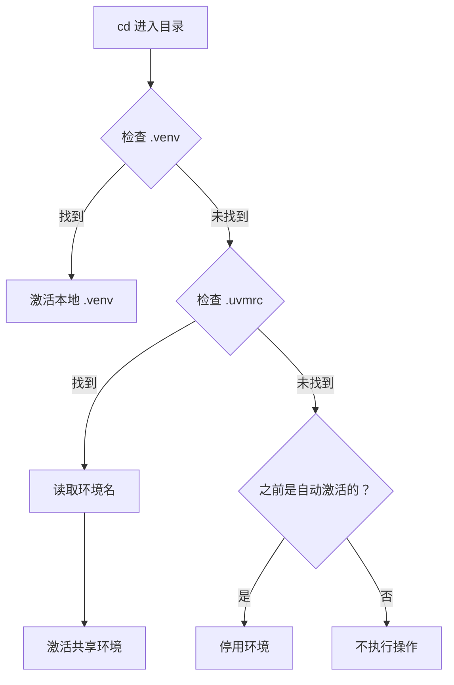

# uvm - UV 环境管理器

<div align="center">

**类似 Conda 的 UV 环境管理工具**

[](https://opensource.org/licenses/MIT)
[](https://www.gnu.org/software/bash/)
[](https://github.com/Tendo33/uvm)

使用 UV 的超快性能和 Conda 风格的直观命令，简化 Python 虚拟环境管理。

[功能特性](#-功能特性) • [安装](#-安装) • [快速开始](#-快速开始) • [使用方法](#-使用方法) • [自动激活](#-自动激活) • [故障排除](#-故障排除) • [卸载](#-卸载)

</div>

---

## 🌟 功能特性

- **🚀 Conda 风格命令**：熟悉的 `create`、`activate`、`deactivate`、`delete`、`list` 命令
- **⚡ UV 驱动**：利用 UV 的 10-100 倍更快的包安装速度
- **🔄 智能自动激活**：进入项目目录时自动激活环境
- **🌏 国内镜像**：预配置清华大学镜像源，下载更快
- **🎯 双模式支持**：
  - **本地 `.venv`**：自动检测项目本地环境
  - **共享环境**：在 `~/uv_envs/` 集中管理环境
- **🖥️ 跨平台**：支持 Linux、macOS 和 Windows（Git Bash）

---

## 📋 前置要求

- **Bash**（或 Zsh）
- **UV**（如未安装，安装时会提示安装）

---

## 🚀 安装

### 推荐方式：先下载后执行

为了交互式安装能正常工作（可以自定义选项），请先下载脚本再执行：

**Linux / macOS：**

```bash
# 下载安装脚本
curl -fsSL https://raw.githubusercontent.com/Tendo33/uvm/main/install.sh -o install.sh

# 执行安装（交互式向导）
bash install.sh

# 安装完成后可删除脚本
rm install.sh
```

**使用 wget：**

```bash
wget -qO install.sh https://raw.githubusercontent.com/Tendo33/uvm/main/install.sh
bash install.sh
rm install.sh
```

**Windows（Git Bash）：**

```bash
# 1. 首先在 PowerShell 中安装 UV（仅需一次）
powershell -ExecutionPolicy ByPass -c "irm https://astral.sh/uv/install.ps1 | iex"

# 2. 在 Git Bash 中下载并执行安装脚本
curl -fsSL https://raw.githubusercontent.com/Tendo33/uvm/main/install.sh -o install.sh
bash install.sh
rm install.sh
```

安装向导会引导您完成：
- **📁 环境目录**（默认：`~/uv_envs`）
- **🔧 UV 安装**（如未安装会自动安装）
- **🐚 自动激活**（可选但推荐）

### 安装选项

**非交互式安装（使用默认配置）：**

```bash
curl -fsSL https://raw.githubusercontent.com/Tendo33/uvm/main/install.sh -o install.sh
bash install.sh -y
```

**自定义环境目录：**

```bash
curl -fsSL https://raw.githubusercontent.com/Tendo33/uvm/main/install.sh -o install.sh
bash install.sh --envs-dir /custom/path
```

**安装特定版本：**

```bash
# 安装特定标签版本
curl -fsSL https://raw.githubusercontent.com/Tendo33/uvm/v1.0.1/install.sh -o install.sh
bash install.sh

# 安装开发分支
curl -fsSL https://raw.githubusercontent.com/Tendo33/uvm/dev/install.sh -o install.sh
bash install.sh
```

### 开发者安装（手动方式）

如果您想修改 uvm 或贡献代码：

```bash
git clone https://github.com/Tendo33/uvm.git
cd uvm
./install.sh
```

### 安装后配置

重新加载 Shell 配置：

```bash
source ~/.bashrc  # Zsh 用户使用 ~/.zshrc
```

**启用自动激活**（可选但推荐）：

```bash
echo 'eval "$(uvm shell-hook)"' >> ~/.bashrc
source ~/.bashrc
```

---

## 🎯 快速开始

```bash
# 创建 Python 3.11 环境
uvm create myenv --python 3.11

# 激活环境
uvm activate myenv

# 安装包（使用 UV 的速度）
pip install requests numpy pandas

# 列出所有环境
uvm list

# 停用环境
uvm deactivate

# 删除环境
uvm delete myenv
```

---

## 📖 使用方法

### 基本命令

#### 创建环境

```bash
# 使用默认 Python 创建
uvm create myenv

# 使用指定 Python 版本创建
uvm create myenv --python 3.11

# 在自定义位置创建
uvm create myenv --path /custom/path
```

#### 激活环境

```bash
uvm activate myenv
```

> **注意**：需要 Shell 集成。请先运行 `eval "$(uvm shell-hook)"`。

#### 停用环境

```bash
uvm deactivate
```

#### 列出环境

```bash
# 列出所有环境
uvm list

# 输出示例：
#   myenv                     Python 3.11.5      /home/user/uv_envs/myenv
# * active-env                Python 3.12.0      /home/user/uv_envs/active-env
```

`*` 表示当前激活的环境。

#### 删除环境

```bash
# 确认后删除
uvm delete myenv

# 强制删除（跳过确认）
uvm delete myenv --force
```

---

## 🔄 自动激活

uvm 支持**智能自动激活**，有两个优先级：

### 优先级 1：本地 `.venv`（最高）

自动检测并激活项目本地的 `.venv` 目录：

```bash
# 在项目中
cd ~/my-project
uv venv  # 或 uv sync

# 进入目录 → 自动激活
cd ~/my-project
# 🔄 Auto-activating local .venv

# 离开目录 → 自动停用
cd ~
# 🔻 Deactivating environment (left project directory)
```

**使用场景**：使用 `pyproject.toml` 的现代项目，独立项目环境。

### 优先级 2：通过 `.uvmrc` 使用共享环境

为使用 `requirements.txt` 的项目指定共享环境：

```bash
# 创建共享测试环境
uvm create test-env --python 3.11

# 在老项目中
cd ~/legacy-project
echo "test-env" > .uvmrc

# 进入目录 → 自动激活
cd ~/legacy-project
# 🔄 Auto-activating uvm environment: test-env
```

**使用场景**：多项目共享同一环境、测试环境、学习环境。

### 对比表

| 场景 | 环境位置 | 激活方式 | 使用场景 |
|------|----------|----------|----------|
| 本地环境 | `./venv` | 自动检测 | 独立项目，`pyproject.toml` 项目 |
| 共享环境 | `~/uv_envs/myenv` | `.uvmrc` 文件 | 多项目共享，测试环境 |
| 手动激活 | `~/uv_envs/myenv` | `uvm activate myenv` | 临时使用，快速测试 |

---

## ⚙️ 配置

### 配置文件

- **uvm 配置**：`~/.config/uvm/`
  - `envs.json`：环境元数据
- **UV 配置**：`~/.config/uv/uv.toml`
  - PyPI 镜像：`https://pypi.tuna.tsinghua.edu.cn/simple`
  - Python 下载：`https://mirrors.tuna.tsinghua.edu.cn/python-releases/`

### 环境变量

```bash
# 自定义环境目录（默认：~/uv_envs）
export UVM_ENVS_DIR="${HOME}/my-custom-envs"

# 自定义配置目录（默认：~/.config/uvm）
export UVM_HOME="${HOME}/.uvm"
```

### 重新配置镜像

```bash
uvm config mirror
```

### 查看当前配置

```bash
uvm config show
```

---

## 🛠️ 故障排除

### `uvm: command not found`

**解决方法**：确保 `~/.local/bin` 在 PATH 中：

```bash
echo 'export PATH="${HOME}/.local/bin:$PATH"' >> ~/.bashrc
source ~/.bashrc
```

### `uvm activate` 不工作

**解决方法**：启用 Shell 集成：

```bash
echo 'eval "$(uvm shell-hook)"' >> ~/.bashrc
source ~/.bashrc
```

### 自动激活不工作

**检查清单**：
1. ✅ Shell hook 已启用：`~/.bashrc` 中有 `eval "$(uvm shell-hook)"`
2. ✅ Shell 已重新加载：`source ~/.bashrc`
3. ✅ `.uvmrc` 文件包含有效的环境名称
4. ✅ `.venv` 目录存在且包含 `bin/activate` 脚本

### 包下载慢

**解决方法**：验证镜像配置：

```bash
cat ~/.config/uv/uv.toml

# 应该包含：
# [[index]]
# url = "https://pypi.tuna.tsinghua.edu.cn/simple"
# default = true
```

如果没有，运行：

```bash
uvm config mirror
```

---

## 🤝 与其他工具对比

| 功能 | uvm | Conda | venv + pip |
|------|-----|-------|------------|
| 速度 | ⚡⚡⚡ (UV) | 🐌 | 🐌🐌 |
| 自动激活 | ✅ | ❌ | ❌ |
| 国内镜像 | ✅ (内置) | ⚙️ (手动) | ⚙️ (手动) |
| Python 版本管理 | ✅ | ✅ | ❌ |
| 磁盘空间 | 💾 (小) | 💾💾💾 (大) | 💾 (小) |
| 学习曲线 | 📚 (简单) | 📚📚 (中等) | 📚 (简单) |

---

## 📚 高级用法

### 自定义环境位置

```bash
# 在指定路径创建环境
uvm create myenv --path /mnt/data/envs/myenv

# 环境仍会被 uvm 追踪
uvm list  # 显示自定义路径
```

### 多 Python 版本

```bash
# 创建不同 Python 版本的环境
uvm create py38 --python 3.8
uvm create py311 --python 3.11
uvm create py312 --python 3.12

# 轻松切换
uvm activate py311
```

### 项目专属环境

**方式 1：本地 `.venv`（推荐用于现代项目）**

```bash
cd ~/my-project
uv venv
uv pip install -r requirements.txt
# 进入目录时自动激活
```

**方式 2：使用 `.uvmrc` 的共享环境**

```bash
cd ~/my-project
uvm create my-project-env --python 3.11
echo "my-project-env" > .uvmrc
# 进入目录时自动激活
```

---

## 🔍 工作原理



---

## 🐛 已知问题

- **Windows**：
  - ✅ **uvm 在 Git Bash 中完全正常工作**
  - ❌ 不支持 PowerShell/CMD（请使用 Git Bash）
  - ℹ️ UV 必须先手动安装（见安装说明）
- **Shell 集成**：必须运行 `eval "$(uvm shell-hook)"` 才能使用 `activate`/`deactivate`。

---

## 🗺️ 路线图

- [ ] 支持 `pyenv` 集成
- [ ] 环境导出/导入（`uvm export`、`uvm import`）
- [ ] 环境克隆（`uvm clone`）
- [ ] Shell 补全（Bash/Zsh）
- [ ] Fish shell 支持

---

## 📄 许可证

本项目采用 MIT 许可证 - 详见 [LICENSE](LICENSE) 文件。

---

## 🙏 致谢

- [astral-sh/uv](https://github.com/astral-sh/uv) - 超快的 Python 包安装器
- [uv-custom](https://github.com/Wangnov/uv-custom) - 国内镜像配置灵感
- [Conda](https://docs.conda.io/) - 命令设计灵感

---

## 🗑️ 卸载

### 推荐方式：先下载后执行

为了交互式卸载能正常工作，请先下载脚本再执行：

```bash
# 下载卸载脚本
curl -fsSL https://raw.githubusercontent.com/Tendo33/uvm/main/uninstall.sh -o uninstall.sh

# 执行卸载（交互式确认）
bash uninstall.sh

# 卸载完成后删除脚本
rm uninstall.sh
```

### 卸载选项

```bash
# 强制卸载（跳过确认）
bash uninstall.sh --force

# 保留 Shell 配置
bash uninstall.sh --keep-shell-config
```

### 手动卸载

如果已克隆仓库：

```bash
cd /path/to/uvm
./uninstall.sh
```

**会被删除的内容：**
- UVM 二进制文件和库文件
- 配置文件
- Shell 集成

**会保留的内容：**
- 您的虚拟环境（`~/uv_envs`）
- UV 本身
- UV 配置（`~/.config/uv/uv.toml`）

📖 **详细指南：** [UNINSTALL.md](project_document/UNINSTALL.md)

---

## 📞 支持

- **问题反馈**：[GitHub Issues](https://github.com/Tendo33/uvm/issues)
- **讨论交流**：[GitHub Discussions](https://github.com/Tendo33/uvm/discussions)

---

<div align="center">

**为追求速度和简洁的 Python 开发者用 ❤️ 打造**

⭐ 如果觉得有用请给个 Star！

</div>
