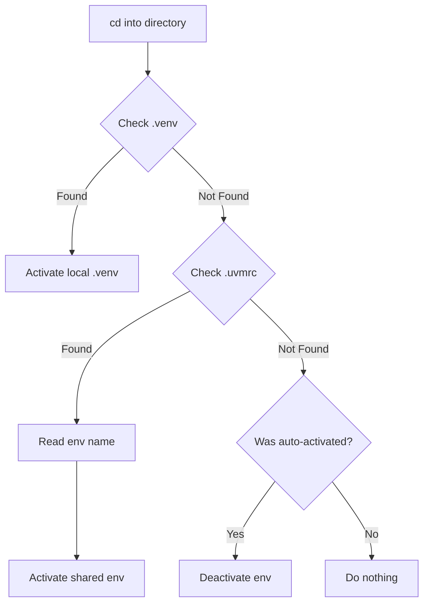

# uvm - UV Environment Manager

<div align="center">

**Conda-like UV Environment Management Tool**

[](https://opensource.org/licenses/MIT)
[](https://www.gnu.org/software/bash/)
[](https://github.com/Tendo33/uvm)

Simplify Python virtual environment management with the ultra-fast performance of UV and intuitive Conda-style commands.

[Features](#-features) • [Installation](#-installation) • [Quick Start](#-quick-start) • [Usage](#-usage) • [Auto Activation](#-auto-activation) • [Troubleshooting](#-troubleshooting) • [Uninstall](#-uninstall)

</div>

---

## 🌟 Features

- **🚀 Conda-style Commands**: Familiar `create`, `activate`, `deactivate`, `delete`, `list` commands
- **⚡ UV Powered**: Leverage UV's 10-100x faster package installation speed
- **🔄 Smart Auto-activation**: Automatically activates the environment when entering a project directory
- **🌏 Mirror Configuration**: Pre-configured mirrors (e.g., Tsinghua) for faster downloads in some regions
- **🎯 Dual Mode Support**:
  - **Local `.venv`**: Automatically detects project local environments
  - **Shared Environments**: Centralized management in `~/uv_envs/`
- **🖥️ Cross-platform**: Supports Linux, macOS, and Windows (Git Bash)

---

## 📋 Prerequisites

- **Bash** (or Zsh)
- **UV** (If not installed, the installer will prompt to install it)

---

## 🚀 Installation

### Recommended: Download then Execute

To ensure the interactive installation works correctly (allowing customization), please download the script before executing it:

**Linux / macOS:**

```bash
# Download installation script
curl -fsSL https://raw.githubusercontent.com/Tendo33/uvm/main/install.sh -o install.sh

# Execute installation (Interactive Wizard)
bash install.sh

# Remove script after installation
rm install.sh
```

**Using wget:**

```bash
wget -qO install.sh https://raw.githubusercontent.com/Tendo33/uvm/main/install.sh
bash install.sh
rm install.sh
```

**Windows (Git Bash):**

```bash
# 1. Install UV in PowerShell first (Only needs to be done once)
powershell -ExecutionPolicy ByPass -c "irm https://astral.sh/uv/install.ps1 | iex"

# 2. Download and execute installation script in Git Bash
curl -fsSL https://raw.githubusercontent.com/Tendo33/uvm/main/install.sh -o install.sh
bash install.sh
rm install.sh
```

The installation wizard will guide you through:
- **📁 Environment Directory** (Default: `~/uv_envs`)
- **🔧 UV Installation** (Will install automatically if missing)
- **🐚 Auto-activation** (Optional but recommended)

### Installation Options

**Non-interactive Installation (Use defaults):**

```bash
curl -fsSL https://raw.githubusercontent.com/Tendo33/uvm/main/install.sh -o install.sh
bash install.sh -y
```

**Custom Environment Directory:**

```bash
curl -fsSL https://raw.githubusercontent.com/Tendo33/uvm/main/install.sh -o install.sh
bash install.sh --envs-dir /custom/path
```

**Install Specific Version:**

```bash
# Install specific tag version
curl -fsSL https://raw.githubusercontent.com/Tendo33/uvm/v1.0.1/install.sh -o install.sh
bash install.sh

# Install development branch
curl -fsSL https://raw.githubusercontent.com/Tendo33/uvm/dev/install.sh -o install.sh
bash install.sh
```

### Developer Installation (Manual)

If you want to modify uvm or contribute:

```bash
git clone https://github.com/Tendo33/uvm.git
cd uvm
./install.sh
```

### Post-installation Configuration

Reload Shell configuration:

```bash
source ~/.bashrc  # Zsh users use ~/.zshrc
```

**Enable Auto-activation** (Optional but recommended):

```bash
echo 'eval "$(uvm shell-hook)"' >> ~/.bashrc
source ~/.bashrc
```

---

## 🎯 Quick Start

```bash
# Create a Python 3.11 environment
uvm create myenv --python 3.11

# Activate environment
uvm activate myenv

# Install packages (Using UV speed)
pip install requests numpy pandas

# List all environments
uvm list

# Deactivate environment
uvm deactivate

# Delete environment
uvm delete myenv
```

---

## 📖 Usage

### Basic Commands

#### Create Environment

```bash
# Create using default Python
uvm create myenv

# Create using specific Python version
uvm create myenv --python 3.11

# Create in custom location
uvm create myenv --path /custom/path
```

#### Activate Environment

```bash
uvm activate myenv
```

> **Note**: Requires Shell integration. Please run `eval "$(uvm shell-hook)"` first.

#### Deactivate Environment

```bash
uvm deactivate
```

#### List Environments

```bash
# List all environments
uvm list

# Output example:
#   myenv                     Python 3.11.5      /home/user/uv_envs/myenv
# * active-env                Python 3.12.0      /home/user/uv_envs/active-env
```

`*` indicates the currently active environment.

#### Delete Environment

```bash
# Delete after confirmation
uvm delete myenv

# Force delete (Skip confirmation)
uvm delete myenv --force
```

---

## 🔄 Auto Activation

uvm supports **Smart Auto-activation** with two priorities:

### Priority 1: Local `.venv` (Highest)

Automatically detects and activates the project's local `.venv` directory:

```bash
# In project
cd ~/my-project
uv venv  # or uv sync

# Enter directory -> Auto activate
cd ~/my-project
# 🔄 Auto-activating local .venv

# Leave directory -> Auto deactivate
cd ~
# 🔻 Deactivating environment (left project directory)
```

**Scenario**: Modern projects using `pyproject.toml`, standalone project environments.

### Priority 2: Shared Environment via `.uvmrc`

Specify a shared environment for projects using `requirements.txt`:

```bash
# Create shared test environment
uvm create test-env --python 3.11

# In legacy project
cd ~/legacy-project
echo "test-env" > .uvmrc

# Enter directory -> Auto activate
cd ~/legacy-project
# 🔄 Auto-activating uvm environment: test-env
```

**Scenario**: Multiple projects sharing the same environment, test environments, learning environments.

### Comparison Table

| Scenario | Environment Location | Activation Method | Use Case |
|----------|----------------------|-------------------|----------|
| Local Environment | `./venv` | Auto Detection | Standalone projects, `pyproject.toml` projects |
| Shared Environment | `~/uv_envs/myenv` | `.uvmrc` file | Multi-project sharing, test environments |
| Manual Activation | `~/uv_envs/myenv` | `uvm activate myenv` | Temporary use, quick testing |

---

## ⚙️ Configuration

### Configuration Files

- **uvm Config**: `~/.config/uvm/`
  - `envs.json`: Environment metadata
- **UV Config**: `~/.config/uv/uv.toml`
  - PyPI Mirror: `https://pypi.tuna.tsinghua.edu.cn/simple`
  - Python Downloads: `https://mirrors.tuna.tsinghua.edu.cn/python-releases/`

### Environment Variables

```bash
# Custom environment directory (Default: ~/uv_envs)
export UVM_ENVS_DIR="${HOME}/my-custom-envs"

# Custom config directory (Default: ~/.config/uvm)
export UVM_HOME="${HOME}/.uvm"
```

### Reconfigure Mirror

```bash
uvm config mirror
```

### Show Current Configuration

```bash
uvm config show
```

---

## 🛠️ Troubleshooting

### `uvm: command not found`

**Solution**: Ensure `~/.local/bin` is in your PATH:

```bash
echo 'export PATH="${HOME}/.local/bin:$PATH"' >> ~/.bashrc
source ~/.bashrc
```

### `uvm activate` not working

**Solution**: Enable Shell integration:

```bash
echo 'eval "$(uvm shell-hook)"' >> ~/.bashrc
source ~/.bashrc
```

### Auto-activation not working

**Checklist**:
1. ✅ Shell hook enabled: `~/.bashrc` contains `eval "$(uvm shell-hook)"`
2. ✅ Shell reloaded: `source ~/.bashrc`
3. ✅ `.uvmrc` file contains valid environment name
4. ✅ `.venv` directory exists and contains `bin/activate` script

### Slow Package Download

**Solution**: Verify mirror configuration:

```bash
cat ~/.config/uv/uv.toml

# Should contain:
# [[index]]
# url = "https://pypi.tuna.tsinghua.edu.cn/simple"
# default = true
```

If not, run:

```bash
uvm config mirror
```

---

## 🤝 Comparison with Other Tools

| Feature | uvm | Conda | venv + pip |
|---------|-----|-------|------------|
| Speed | ⚡⚡⚡ (UV) | 🐌 | 🐌🐌 |
| Auto Activation | ✅ | ❌ | ❌ |
| Mirrors | ✅ (Built-in) | ⚙️ (Manual) | ⚙️ (Manual) |
| Python Version Mgmt | ✅ | ✅ | ❌ |
| Disk Space | 💾 (Small) | 💾💾💾 (Large) | 💾 (Small) |
| Learning Curve | 📚 (Easy) | 📚📚 (Medium) | 📚 (Easy) |

---

## 📚 Advanced Usage

### Custom Environment Location

```bash
# Create environment in specific path
uvm create myenv --path /mnt/data/envs/myenv

# Environment still tracked by uvm
uvm list  # Shows custom path
```

### Multiple Python Versions

```bash
# Create environments with different Python versions
uvm create py38 --python 3.8
uvm create py311 --python 3.11
uvm create py312 --python 3.12

# Easy switch
uvm activate py311
```

### Project Specific Environments

**Method 1: Local `.venv` (Recommended for modern projects)**

```bash
cd ~/my-project
uv venv
uv pip install -r requirements.txt
# Auto activates on directory entry
```

**Method 2: Shared Environment via `.uvmrc`**

```bash
cd ~/my-project
uvm create my-project-env --python 3.11
echo "my-project-env" > .uvmrc
# Auto activates on directory entry
```

---

## 🔍 How it Works


```mermaid
graph TD
    A[cd into directory] --> B{Check .venv}
    B -->|Found| C[Activate local .venv]
    B -->|Not Found| D{Check .uvmrc}
    D -->|Found| E[Read env name]
    E --> F[Activate shared env]
    D -->|Not Found| G{Was auto-activated?}
    G -->|Yes| H[Deactivate env]
    G -->|No| I[Do nothing]
```

---

## 🐛 Known Issues

- **Windows**:
  - ✅ **uvm works perfectly in Git Bash**
  - ❌ PowerShell/CMD not supported (Please use Git Bash)
  - ℹ️ UV must be installed manually first (See installation instructions)
- **Shell Integration**: Must run `eval "$(uvm shell-hook)"` to use `activate`/`deactivate`.

---

## 🗺️ Roadmap

- [ ] Support `pyenv` integration
- [ ] Environment Export/Import (`uvm export`, `uvm import`)
- [ ] Environment Clone (`uvm clone`)
- [ ] Shell Completion (Bash/Zsh)
- [ ] Fish shell support

---

## 📄 License

This project is licensed under the MIT License - see the [LICENSE](LICENSE) file for details.

---

## 🙏 Acknowledgements

- [astral-sh/uv](https://github.com/astral-sh/uv) - Ultra-fast Python package installer
- [uv-custom](https://github.com/Wangnov/uv-custom) - Inspiration for mirror configuration
- [Conda](https://docs.conda.io/) - Inspiration for command design

---

## 🗑️ Uninstall

### Recommended: Download then Execute

To ensure interactive uninstall works correctly, please download the script first:

```bash
# Download uninstall script
curl -fsSL https://raw.githubusercontent.com/Tendo33/uvm/main/uninstall.sh -o uninstall.sh

# Execute uninstall (Interactive confirm)
bash uninstall.sh

# Remove script after uninstall
rm uninstall.sh
```

### Uninstall Options

```bash
# Force uninstall (Skip confirmation)
bash uninstall.sh --force

# Keep Shell config
bash uninstall.sh --keep-shell-config
```

### Manual Uninstall

If you cloned the repository:

```bash
cd /path/to/uvm
./uninstall.sh
```

**What will be deleted:**
- UVM binaries and libraries
- Configuration files
- Shell integration

**What will be kept:**
- Your virtual environments (`~/uv_envs`)
- UV itself
- UV config (`~/.config/uv/uv.toml`)

📖 **Detailed Guide:** [UNINSTALL.md](project_document/UNINSTALL.md)

---

## 📞 Support

- **Issues**: [GitHub Issues](https://github.com/Tendo33/uvm/issues)
- **Discussions**: [GitHub Discussions](https://github.com/Tendo33/uvm/discussions)

---

<div align="center">

**Built with ❤️ for Python developers who value speed and simplicity**

⭐ Give it a Star if you find it useful!

</div>
