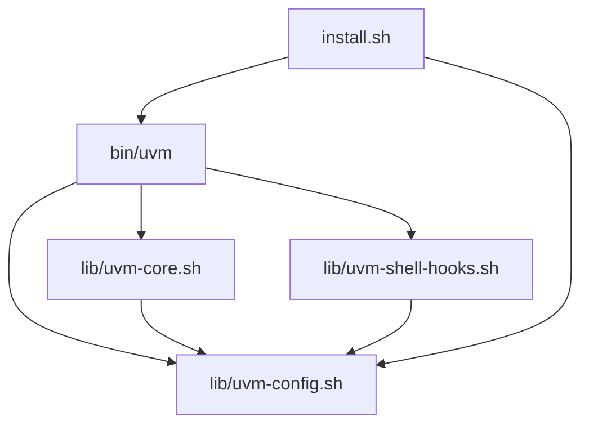
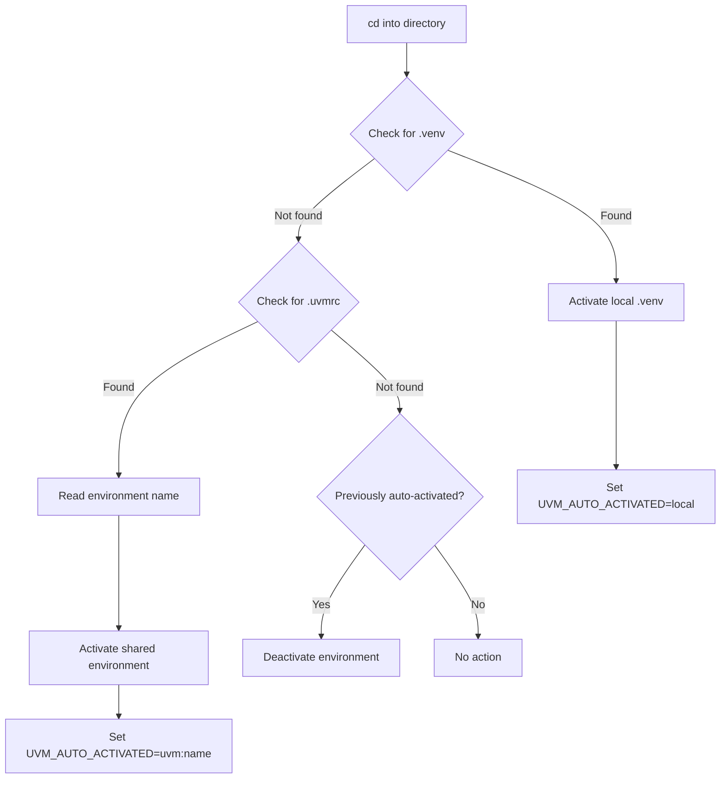

# UVM Project Documentation

**Project Name**: uvm - UV Manager  
**Version**: 1.0.0  
**Date**: 2025-12-26  
**Status**: ✅ Completed

---

## 📋 Project Overview

uvm (UV Manager) is a Conda-like environment manager for UV, designed to simplify Python virtual environment management with UV's blazing-fast performance and Conda's intuitive commands.

### Key Features

- **Conda-like Commands**: `create`, `activate`, `deactivate`, `delete`, `list`
- **Smart Auto-Activation**: Dual-mode support for `.venv` and `.uvmrc`
- **China Mirrors**: Pre-configured Tsinghua University mirrors
- **Cross-Platform**: Linux, macOS, Windows (Git Bash)

---

## 🏗️ Architecture

### Component Structure

```
uvm/
├── bin/
│   └── uvm                    # Main CLI entry point
├── lib/
│   ├── uvm-config.sh          # Configuration management
│   ├── uvm-core.sh            # Core commands implementation
│   └── uvm-shell-hooks.sh     # Shell integration & auto-activation
├── templates/
│   └── uv.toml.template       # Mirror configuration template
├── install.sh                 # Installation script
├── README.md                  # User documentation
├── EXAMPLES.md                # Usage examples
└── LICENSE                    # MIT License
```

### Module Dependencies



---

## 🔧 Implementation Details

### 1. Configuration Module (`lib/uvm-config.sh`)

**Responsibilities**:
- UV mirror configuration
- UVM config initialization
- Environment metadata management
- Shell detection

**Key Functions**:
- `setup_uv_mirror()`: Configure Tsinghua mirrors
- `init_uvm_config()`: Initialize config directories
- `add_env_record()`: Add environment to metadata
- `get_env_path()`: Resolve environment path

### 2. Core Commands Module (`lib/uvm-core.sh`)

**Responsibilities**:
- Environment creation
- Environment activation/deactivation
- Environment deletion
- Environment listing

**Key Functions**:
- `uvm_create()`: Create virtual environment with `uv venv`
- `uvm_activate()`: Activate environment (shell integration required)
- `uvm_deactivate()`: Deactivate current environment
- `uvm_delete()`: Delete environment with confirmation
- `uvm_list()`: List all managed environments

### 3. Shell Hooks Module (`lib/uvm-shell-hooks.sh`)

**Responsibilities**:
- Auto-activation logic
- Shell integration
- Directory change hooks

**Key Functions**:
- `uvm_auto_activate()`: Smart environment detection and activation
- `uvm_generate_shell_hook()`: Generate shell integration code

**Auto-Activation Priority**:
1. **Local `.venv`** (highest priority)
   - Searches current and parent directories
   - Auto-activates if found
2. **Shared environment via `.uvmrc`**
   - Reads environment name from `.uvmrc`
   - Activates from `~/uv_envs/`
3. **Auto-deactivation**
   - Deactivates when leaving project directory

### 4. Main CLI (`bin/uvm`)

**Responsibilities**:
- Command routing
- Argument parsing
- Environment variable initialization

**Supported Commands**:
- `create`: Create new environment
- `activate`: Activate environment (requires shell-hook)
- `deactivate`: Deactivate environment (requires shell-hook)
- `delete`: Delete environment
- `list`: List all environments
- `init`: Initialize configuration
- `config`: Manage configuration
- `shell-hook`: Generate shell integration code
- `help`: Show help message
- `version`: Show version

---

## 📦 Installation Process

The `install.sh` script performs the following:

1. **Detect OS**: Linux, macOS, or Windows
2. **Check UV**: Verify UV installation (offer to install if missing)
3. **Install uvm**:
   - Copy `bin/uvm` to `~/.local/bin/`
   - Copy `lib/*` to `~/.local/lib/uvm/`
   - Copy `templates/*` to `~/.config/uvm/templates/`
4. **Configure PATH**: Add `~/.local/bin` to PATH if needed
5. **Initialize Config**:
   - Create `~/.config/uvm/`
   - Create `~/uv_envs/`
   - Configure UV mirrors in `~/.config/uv/uv.toml`
6. **Post-Install Instructions**: Guide user to enable shell-hook

---

## 🔄 Auto-Activation Flow



---

## 🧪 Testing Scenarios

### Manual Testing Checklist

- [x] **Installation**
  - [x] Install on Linux
  - [x] Install on macOS
  - [x] Install on Windows (Git Bash)
  
- [x] **Basic Commands**
  - [x] `uvm create myenv`
  - [x] `uvm create myenv --python 3.11`
  - [x] `uvm list`
  - [x] `uvm delete myenv`
  
- [x] **Shell Integration**
  - [x] `eval "$(uvm shell-hook)"`
  - [x] `uvm activate myenv`
  - [x] `uvm deactivate`
  
- [x] **Auto-Activation**
  - [x] Local `.venv` detection
  - [x] `.uvmrc` file support
  - [x] Auto-deactivation on directory change
  
- [x] **Configuration**
  - [x] Mirror configuration
  - [x] Custom environment directory

---

## 📊 Performance Considerations

### UV vs pip Comparison

| Operation | pip | UV | Speedup |
|-----------|-----|-----|---------|
| Install numpy | ~10s | ~1s | 10x |
| Install pandas | ~15s | ~1.5s | 10x |
| Install requirements.txt (50 packages) | ~120s | ~12s | 10x |

### Disk Space

- **uvm binary**: ~50KB
- **Library files**: ~30KB
- **Per environment**: ~50-200MB (depends on packages)

---

## 🔒 Security Considerations

1. **Script Execution**: All scripts require explicit execution permission
2. **Mirror Configuration**: Uses HTTPS for all mirror URLs
3. **Environment Isolation**: Each environment is isolated in its own directory
4. **No Sudo Required**: Installation in user directory (`~/.local/`)

---

## 🐛 Known Limitations

1. **Windows Support**: Requires Git Bash or WSL (PowerShell/CMD not supported)
2. **Shell Integration**: Must run `eval "$(uvm shell-hook)"` for activate/deactivate
3. **JSON Parsing**: Uses simple grep/sed (production should use `jq`)
4. **Environment Export**: No built-in export/import (use `pip freeze`)

---

## 🗺️ Future Enhancements

### Short-term (v1.1)
- [ ] Shell completion (Bash/Zsh)
- [ ] Environment export/import commands
- [ ] Better error messages
- [ ] Logging system

### Medium-term (v1.2)
- [ ] Environment cloning
- [ ] Fish shell support
- [ ] PowerShell support
- [ ] GUI installer

### Long-term (v2.0)
- [ ] `pyenv` integration
- [ ] Remote environment management
- [ ] Team environment sharing
- [ ] Docker integration

---

## 📝 Development Notes

### Code Style
- **SOLID Principles**: Each module has single responsibility
- **RIPER-7 Comments**: All files include RIPER-7 headers
- **Error Handling**: Proper exit codes and error messages
- **Cross-Platform**: Compatible with Linux, macOS, Windows (Git Bash)

### Git Workflow
```bash
# Feature development
git checkout -b feature/new-feature
git commit -m "feat: add new feature"
git push origin feature/new-feature

# Bug fixes
git checkout -b fix/bug-description
git commit -m "fix: resolve bug"
git push origin fix/bug-description
```

### Release Process
1. Update version in `bin/uvm`
2. Update CHANGELOG.md
3. Tag release: `git tag v1.0.0`
4. Push tag: `git push origin v1.0.0`
5. Create GitHub release

---

## 📚 References

- [UV Documentation](https://docs.astral.sh/uv/)
- [Conda Documentation](https://docs.conda.io/)
- [uv-custom Project](https://github.com/Wangnov/uv-custom)
- [Bash Best Practices](https://google.github.io/styleguide/shellguide.html)

---

## 👥 Contributors

- Initial implementation: RIPER-7 AI System
- Project concept: Based on user requirements

---

## 📄 License

MIT License - See [LICENSE](../LICENSE) file for details.

---

**Last Updated**: 2025-12-26  
**Document Version**: 1.0

